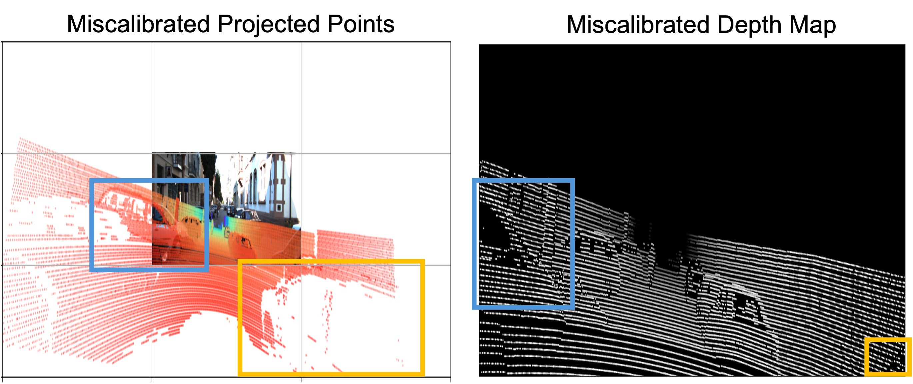
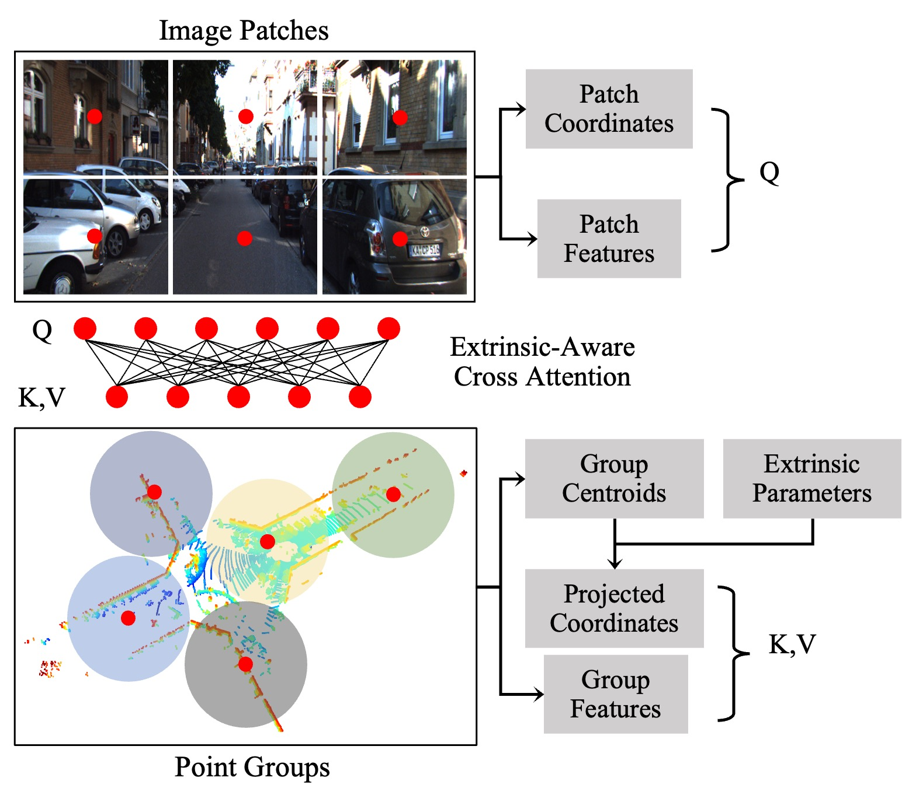
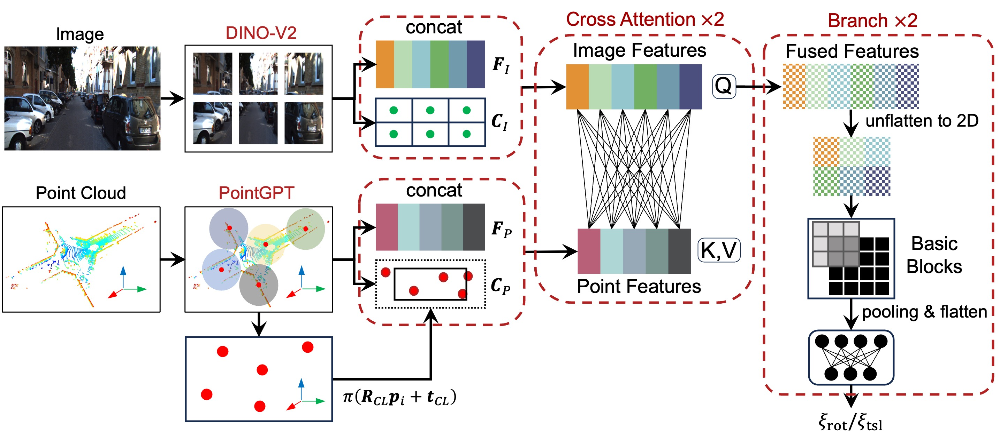

<h1 align="center">🚀 NativeCross</h1>
<p align="center">
  <b>Native-Domain Cross-Attention for Camera-LiDAR Extrinsic Calibration Under Large Initial Perturbations</b>
</p>

<p align="center">
  
  
  
  <a href="https://ieeexplore.ieee.org/document/11480778">
    
  </a>
  <a href="https://arxiv.org/abs/2603.29414">
    
  </a>
</p>


This paper addresses camera-LiDAR extrinsic calibration under severe initial pose misalignment. Most existing methods rely on depth-map projection to extract point-cloud features, but large perturbations push many LiDAR points outside the image boundary, which degrades feature quality and ultimately harms calibration accuracy.

<div align="center">
  
</div>


We propose a native-domain cross-attention mechanism that directly aligns camera and LiDAR features without depth-map projection. This design preserves geometric consistency and enables robust calibration even under large initial misalignment (see the Abstract for details).
<div align="center">
  
</div>

## Abstract
Accurate camera-LiDAR fusion relies on precise extrinsic calibration, which fundamentally depends on establishing reliable cross-modal correspondences under potentially large misalignments. Existing learning-based methods typically project LiDAR points into depth maps for feature fusion, which distorts 3D geometry and degrades performance when the extrinsic initialization is far from the ground truth. To address this issue, we propose an extrinsic-aware cross-attention framework that directly aligns image patches and LiDAR point groups in their native domains. The proposed attention mechanism explicitly injects extrinsic parameter hypotheses into the correspondence modeling process, enabling geometry-consistent cross-modal interaction without relying on projected 2D depth maps. Extensive experiments on the KITTI and nuScenes benchmarks demonstrate that our method consistently outperforms state-of-the-art approaches in both accuracy and robustness. Under large extrinsic perturbations, our approach achieves accurate calibration in 88% of KITTI cases and 99% of nuScenes cases, substantially surpassing the second-best baseline. We have open sourced our code on this https URL to benefit the community.

## Pipeline


## Metric
- RRMSE: Rotation RMSE
- tRMSE: Translation RMSE
- RMAE: Rotation MAE
- tMAE: Translation MAE
- L1: Percentage of results whose RRMSE < and tRMSE < 2.5cm
- L2: Percentage of results whose RRMSE < 2° and tRMSE < 5cm 

Calculation of metrics can be found in [metrics.py](./metrics.py)

## Calibration Results on KITTI

### Range: 15° / 15cm

<table>
  <thead>
    <tr>
      <th style="background:#000000; color:#FFFFFF;">Dataset</th>
      <th style="background:#000000; color:#FFFFFF;">Method</th>
      <th style="background:#000000; color:#FFFFFF;">RRMSE (°)</th>
      <th style="background:#000000; color:#FFFFFF;">RMAE (°)</th>
      <th style="background:#000000; color:#FFFFFF;">tRMSE (cm)</th>
      <th style="background:#000000; color:#FFFFFF;">tMAE (cm)</th>
      <th style="background:#000000; color:#FFFFFF;">L1 (%)</th>
      <th style="background:#000000; color:#FFFFFF;">L2 (%)</th>
    </tr>
  </thead>
  <tbody>
    <tr>
      <td style="background:#000000; color:#FFFFFF;">KITTI</td>
      <td style="background:#000000; color:#FFFFFF;">CoFiI2P</td>
      <td style="background:#000000; color:#FFFFFF;">4.61</td>
      <td style="background:#000000; color:#FFFFFF;">2.07</td>
      <td style="background:#000000; color:#FFFFFF;">135</td>
      <td style="background:#000000; color:#FFFFFF;">62.6</td>
      <td style="background:#000000; color:#FFFFFF;">0.0%</td>
      <td style="background:#000000; color:#FFFFFF;">0.0%</td>
    </tr>
    <tr>
      <td style="background:#000000; color:#FFFFFF;">KITTI</td>
      <td style="background:#000000; color:#FFFFFF;">DirectCalib</td>
      <td style="background:#000000; color:#FFFFFF;">13.1</td>
      <td style="background:#000000; color:#FFFFFF;">6.31</td>
      <td style="background:#000000; color:#FFFFFF;">195</td>
      <td style="background:#000000; color:#FFFFFF;">98.4</td>
      <td style="background:#000000; color:#FFFFFF;">0.3%</td>
      <td style="background:#000000; color:#FFFFFF;">1.5%</td>
    </tr>
    <tr>
      <td style="background:#000000; color:#FFFFFF;">KITTI</td>
      <td style="background:#000000; color:#FFFFFF;">CalibAnything</td>
      <td style="background:#000000; color:#FFFFFF;">18.3</td>
      <td style="background:#000000; color:#FFFFFF;">9.44</td>
      <td style="background:#000000; color:#FFFFFF;">27.3</td>
      <td style="background:#000000; color:#FFFFFF;">13.8</td>
      <td style="background:#000000; color:#FFFFFF;">0.0%</td>
      <td style="background:#000000; color:#FFFFFF;">1.9%</td>
    </tr>
    <tr>
      <td style="background:#000000; color:#FFFFFF;">KITTI</td>
      <td style="background:#000000; color:#FFFFFF;">CalibNet</td>
      <td style="background:#000000; color:#FFFFFF;">2.02</td>
      <td style="background:#000000; color:#FFFFFF;">0.76</td>
      <td style="background:#000000; color:#FFFFFF;">5.80</td>
      <td style="background:#000000; color:#FFFFFF;">2.84</td>
      <td style="background:#000000; color:#FFFFFF;">8.0%</td>
      <td style="background:#000000; color:#FFFFFF;">32.3%</td>
    </tr>
    <tr>
      <td style="background:#000000; color:#FFFFFF;">KITTI</td>
      <td style="background:#000000; color:#FFFFFF;">RGGNet</td>
      <td style="background:#000000; color:#FFFFFF;">3.88</td>
      <td style="background:#000000; color:#FFFFFF;">1.42</td>
      <td style="background:#000000; color:#FFFFFF;">6.07</td>
      <td style="background:#000000; color:#FFFFFF;">2.97</td>
      <td style="background:#000000; color:#FFFFFF;">5.4%</td>
      <td style="background:#000000; color:#FFFFFF;">18.6%</td>
    </tr>
    <tr>
      <td style="background:#000000; color:#FFFFFF;">KITTI</td>
      <td style="background:#000000; color:#FFFFFF;">LCCNet</td>
      <td style="background:#000000; color:#FFFFFF;">2.10</td>
      <td style="background:#000000; color:#FFFFFF;">0.80</td>
      <td style="background:#000000; color:#FFFFFF;">6.12</td>
      <td style="background:#000000; color:#FFFFFF;">3.01</td>
      <td style="background:#000000; color:#FFFFFF;">9.2%</td>
      <td style="background:#000000; color:#FFFFFF;">31.7%</td>
    </tr>
    <tr>
      <td style="background:#000000; color:#FFFFFF;">KITTI</td>
      <td style="background:#000000; color:#FFFFFF;">LCCRAFT</td>
      <td style="background:#000000; color:#FFFFFF;"><u>0.53</u></td>
      <td style="background:#000000; color:#FFFFFF;"><b>0.21</b></td>
      <td style="background:#000000; color:#FFFFFF;">6.03</td>
      <td style="background:#000000; color:#FFFFFF;">2.90</td>
      <td style="background:#000000; color:#FFFFFF;">11.2%</td>
      <td style="background:#000000; color:#FFFFFF;">44.1%</td>
    </tr>
    <tr>
      <td style="background:#000000; color:#FFFFFF;">KITTI</td>
      <td style="background:#000000; color:#FFFFFF;">CalibDepth</td>
      <td style="background:#000000; color:#FFFFFF;">1.06</td>
      <td style="background:#000000; color:#FFFFFF;">0.42</td>
      <td style="background:#000000; color:#FFFFFF;"><u>4.57</u></td>
      <td style="background:#000000; color:#FFFFFF;"><u>2.23</u></td>
      <td style="background:#000000; color:#FFFFFF;"><u>17.2%</u></td>
      <td style="background:#000000; color:#FFFFFF;"><u>56.9%</u></td>
    </tr>
    <tr>
      <td style="background:#000000; color:#FFFFFF;">KITTI</td>
      <td style="background:#000000; color:#FFFFFF;">Ours</td>
      <td style="background:#000000; color:#FFFFFF;"><b>0.43</b></td>
      <td style="background:#000000; color:#FFFFFF;"><u>0.21</u></td>
      <td style="background:#000000; color:#FFFFFF;"><b>2.20</b></td>
      <td style="background:#000000; color:#FFFFFF;"><b>1.09</b></td>
      <td style="background:#000000; color:#FFFFFF;"><b>54.6%</b></td>
      <td style="background:#000000; color:#FFFFFF;"><b>96.6%</b></td>
    </tr>
  </tbody>
</table>

### Range: 10° / 25cm

<table>
  <thead>
    <tr>
      <th style="background:#000000; color:#FFFFFF;">Dataset</th>
      <th style="background:#000000; color:#FFFFFF;">Method</th>
      <th style="background:#000000; color:#FFFFFF;">RRMSE (°)</th>
      <th style="background:#000000; color:#FFFFFF;">RMAE (°)</th>
      <th style="background:#000000; color:#FFFFFF;">tRMSE (cm)</th>
      <th style="background:#000000; color:#FFFFFF;">tMAE (cm)</th>
      <th style="background:#000000; color:#FFFFFF;">L1 (%)</th>
      <th style="background:#000000; color:#FFFFFF;">L2 (%)</th>
    </tr>
  </thead>
  <tbody>
    <tr>
      <td style="background:#000000; color:#FFFFFF;">KITTI</td>
      <td style="background:#000000; color:#FFFFFF;">CoFiI2P</td>
      <td style="background:#000000; color:#FFFFFF;">2.94</td>
      <td style="background:#000000; color:#FFFFFF;">1.29</td>
      <td style="background:#000000; color:#FFFFFF;">60.7</td>
      <td style="background:#000000; color:#FFFFFF;">28.1</td>
      <td style="background:#000000; color:#FFFFFF;">0.0%</td>
      <td style="background:#000000; color:#FFFFFF;">0.1%</td>
    </tr>
    <tr>
      <td style="background:#000000; color:#FFFFFF;">KITTI</td>
      <td style="background:#000000; color:#FFFFFF;">DirectCalib</td>
      <td style="background:#000000; color:#FFFFFF;">13.1</td>
      <td style="background:#000000; color:#FFFFFF;">6.46</td>
      <td style="background:#000000; color:#FFFFFF;">147</td>
      <td style="background:#000000; color:#FFFFFF;">69.9</td>
      <td style="background:#000000; color:#FFFFFF;">0.4%</td>
      <td style="background:#000000; color:#FFFFFF;">1.8%</td>
    </tr>
    <tr>
      <td style="background:#000000; color:#FFFFFF;">KITTI</td>
      <td style="background:#000000; color:#FFFFFF;">CalibAnything</td>
      <td style="background:#000000; color:#FFFFFF;">5.32</td>
      <td style="background:#000000; color:#FFFFFF;">2.60</td>
      <td style="background:#000000; color:#FFFFFF;">28.2</td>
      <td style="background:#000000; color:#FFFFFF;">14.2</td>
      <td style="background:#000000; color:#FFFFFF;">1.0%</td>
      <td style="background:#000000; color:#FFFFFF;">12.4%</td>
    </tr>
    <tr>
      <td style="background:#000000; color:#FFFFFF;">KITTI</td>
      <td style="background:#000000; color:#FFFFFF;">CalibNet</td>
      <td style="background:#000000; color:#FFFFFF;">2.28</td>
      <td style="background:#000000; color:#FFFFFF;">0.89</td>
      <td style="background:#000000; color:#FFFFFF;">6.47</td>
      <td style="background:#000000; color:#FFFFFF;">3.15</td>
      <td style="background:#000000; color:#FFFFFF;">4.2%</td>
      <td style="background:#000000; color:#FFFFFF;">26.6%</td>
    </tr>
    <tr>
      <td style="background:#000000; color:#FFFFFF;">KITTI</td>
      <td style="background:#000000; color:#FFFFFF;">RGGNet</td>
      <td style="background:#000000; color:#FFFFFF;">3.99</td>
      <td style="background:#000000; color:#FFFFFF;">1.52</td>
      <td style="background:#000000; color:#FFFFFF;">6.23</td>
      <td style="background:#000000; color:#FFFFFF;">3.05</td>
      <td style="background:#000000; color:#FFFFFF;">4.9%</td>
      <td style="background:#000000; color:#FFFFFF;">17.8%</td>
    </tr>
    <tr>
      <td style="background:#000000; color:#FFFFFF;">KITTI</td>
      <td style="background:#000000; color:#FFFFFF;">LCCNet</td>
      <td style="background:#000000; color:#FFFFFF;">2.50</td>
      <td style="background:#000000; color:#FFFFFF;">0.96</td>
      <td style="background:#000000; color:#FFFFFF;">6.08</td>
      <td style="background:#000000; color:#FFFFFF;">2.98</td>
      <td style="background:#000000; color:#FFFFFF;">7.2%</td>
      <td style="background:#000000; color:#FFFFFF;">27.8%</td>
    </tr>
    <tr>
      <td style="background:#000000; color:#FFFFFF;">KITTI</td>
      <td style="background:#000000; color:#FFFFFF;">LCCRAFT</td>
      <td style="background:#000000; color:#FFFFFF;"><b>0.59</b></td>
      <td style="background:#000000; color:#FFFFFF;"><b>0.23</b></td>
      <td style="background:#000000; color:#FFFFFF;">6.27</td>
      <td style="background:#000000; color:#FFFFFF;">2.95</td>
      <td style="background:#000000; color:#FFFFFF;"><u>11.2%</u></td>
      <td style="background:#000000; color:#FFFFFF;"><u>42.4%</u></td>
    </tr>
    <tr>
      <td style="background:#000000; color:#FFFFFF;">KITTI</td>
      <td style="background:#000000; color:#FFFFFF;">CalibDepth</td>
      <td style="background:#000000; color:#FFFFFF;">1.99</td>
      <td style="background:#000000; color:#FFFFFF;">0.74</td>
      <td style="background:#000000; color:#FFFFFF;"><u>5.44</u></td>
      <td style="background:#000000; color:#FFFFFF;"><u>2.60</u></td>
      <td style="background:#000000; color:#FFFFFF;">9.4%</td>
      <td style="background:#000000; color:#FFFFFF;">39.2%</td>
    </tr>
    <tr>
      <td style="background:#000000; color:#FFFFFF;">KITTI</td>
      <td style="background:#000000; color:#FFFFFF;">Ours</td>
      <td style="background:#000000; color:#FFFFFF;"><u>0.65</u></td>
      <td style="background:#000000; color:#FFFFFF;"><u>0.32</u></td>
      <td style="background:#000000; color:#FFFFFF;"><b>2.59</b></td>
      <td style="background:#000000; color:#FFFFFF;"><b>1.29</b></td>
      <td style="background:#000000; color:#FFFFFF;"><b>48.8%</b></td>
      <td style="background:#000000; color:#FFFFFF;"><b>92.6%</b></td>
    </tr>
  </tbody>
</table>

### Range: 10° / 50cm

<table>
  <thead>
    <tr>
      <th style="background:#000000; color:#FFFFFF;">Dataset</th>
      <th style="background:#000000; color:#FFFFFF;">Method</th>
      <th style="background:#000000; color:#FFFFFF;">RRMSE (°)</th>
      <th style="background:#000000; color:#FFFFFF;">RMAE (°)</th>
      <th style="background:#000000; color:#FFFFFF;">tRMSE (cm)</th>
      <th style="background:#000000; color:#FFFFFF;">tMAE (cm)</th>
      <th style="background:#000000; color:#FFFFFF;">L1 (%)</th>
      <th style="background:#000000; color:#FFFFFF;">L2 (%)</th>
    </tr>
  </thead>
  <tbody>
    <tr>
      <td style="background:#000000; color:#FFFFFF;">KITTI</td>
      <td style="background:#000000; color:#FFFFFF;">CoFiI2P</td>
      <td style="background:#000000; color:#FFFFFF;">2.90</td>
      <td style="background:#000000; color:#FFFFFF;">1.26</td>
      <td style="background:#000000; color:#FFFFFF;">87.0</td>
      <td style="background:#000000; color:#FFFFFF;">38.3</td>
      <td style="background:#000000; color:#FFFFFF;">0.0%</td>
      <td style="background:#000000; color:#FFFFFF;">0.0%</td>
    </tr>
    <tr>
      <td style="background:#000000; color:#FFFFFF;">KITTI</td>
      <td style="background:#000000; color:#FFFFFF;">DirectCalib</td>
      <td style="background:#000000; color:#FFFFFF;">12.7</td>
      <td style="background:#000000; color:#FFFFFF;">6.22</td>
      <td style="background:#000000; color:#FFFFFF;">223</td>
      <td style="background:#000000; color:#FFFFFF;">110</td>
      <td style="background:#000000; color:#FFFFFF;">0.0%</td>
      <td style="background:#000000; color:#FFFFFF;">0.8%</td>
    </tr>
    <tr>
      <td style="background:#000000; color:#FFFFFF;">KITTI</td>
      <td style="background:#000000; color:#FFFFFF;">CalibAnything</td>
      <td style="background:#000000; color:#FFFFFF;">6.02</td>
      <td style="background:#000000; color:#FFFFFF;">2.90</td>
      <td style="background:#000000; color:#FFFFFF;">49.9</td>
      <td style="background:#000000; color:#FFFFFF;">24.9</td>
      <td style="background:#000000; color:#FFFFFF;">1.0%</td>
      <td style="background:#000000; color:#FFFFFF;">8.6%</td>
    </tr>
    <tr>
      <td style="background:#000000; color:#FFFFFF;">KITTI</td>
      <td style="background:#000000; color:#FFFFFF;">CalibNet</td>
      <td style="background:#000000; color:#FFFFFF;">2.34</td>
      <td style="background:#000000; color:#FFFFFF;">0.92</td>
      <td style="background:#000000; color:#FFFFFF;">8.30</td>
      <td style="background:#000000; color:#FFFFFF;">4.03</td>
      <td style="background:#000000; color:#FFFFFF;">2.0%</td>
      <td style="background:#000000; color:#FFFFFF;">17.4%</td>
    </tr>
    <tr>
      <td style="background:#000000; color:#FFFFFF;">KITTI</td>
      <td style="background:#000000; color:#FFFFFF;">RGGNet</td>
      <td style="background:#000000; color:#FFFFFF;">4.03</td>
      <td style="background:#000000; color:#FFFFFF;">1.57</td>
      <td style="background:#000000; color:#FFFFFF;">6.51</td>
      <td style="background:#000000; color:#FFFFFF;">3.18</td>
      <td style="background:#000000; color:#FFFFFF;">4.1%</td>
      <td style="background:#000000; color:#FFFFFF;">16.4%</td>
    </tr>
    <tr>
      <td style="background:#000000; color:#FFFFFF;">KITTI</td>
      <td style="background:#000000; color:#FFFFFF;">LCCNet</td>
      <td style="background:#000000; color:#FFFFFF;">2.55</td>
      <td style="background:#000000; color:#FFFFFF;">0.99</td>
      <td style="background:#000000; color:#FFFFFF;">6.72</td>
      <td style="background:#000000; color:#FFFFFF;">3.29</td>
      <td style="background:#000000; color:#FFFFFF;">6.0%</td>
      <td style="background:#000000; color:#FFFFFF;">25.6%</td>
    </tr>
    <tr>
      <td style="background:#000000; color:#FFFFFF;">KITTI</td>
      <td style="background:#000000; color:#FFFFFF;">LCCRAFT</td>
      <td style="background:#000000; color:#FFFFFF;"><u>0.95</u></td>
      <td style="background:#000000; color:#FFFFFF;"><b>0.35</b></td>
      <td style="background:#000000; color:#FFFFFF;">6.48</td>
      <td style="background:#000000; color:#FFFFFF;">3.08</td>
      <td style="background:#000000; color:#FFFFFF;"><u>9.2%</u></td>
      <td style="background:#000000; color:#FFFFFF;">39.1%</td>
    </tr>
    <tr>
      <td style="background:#000000; color:#FFFFFF;">KITTI</td>
      <td style="background:#000000; color:#FFFFFF;">CalibDepth</td>
      <td style="background:#000000; color:#FFFFFF;">1.77</td>
      <td style="background:#000000; color:#FFFFFF;">0.67</td>
      <td style="background:#000000; color:#FFFFFF;"><u>5.28</u></td>
      <td style="background:#000000; color:#FFFFFF;"><u>2.56</u></td>
      <td style="background:#000000; color:#FFFFFF;">8.7%</td>
      <td style="background:#000000; color:#FFFFFF;"><u>41.8%</u></td>
    </tr>
    <tr>
      <td style="background:#000000; color:#FFFFFF;">KITTI</td>
      <td style="background:#000000; color:#FFFFFF;">Ours</td>
      <td style="background:#000000; color:#FFFFFF;"><b>0.76</b></td>
      <td style="background:#000000; color:#FFFFFF;"><u>0.37</u></td>
      <td style="background:#000000; color:#FFFFFF;"><b>2.75</b></td>
      <td style="background:#000000; color:#FFFFFF;"><b>1.36</b></td>
      <td style="background:#000000; color:#FFFFFF;"><b>41.0%</b></td>
      <td style="background:#000000; color:#FFFFFF;"><b>87.7%</b></td>
    </tr>
  </tbody>
</table>


## Calibration Results on nuScenes
### Range: 15° / 15cm

<table>
  <thead>
    <tr>
      <th style="background:#000000; color:#FFFFFF;">Dataset</th>
      <th style="background:#000000; color:#FFFFFF;">Method</th>
      <th style="background:#000000; color:#FFFFFF;">RRMSE (°)</th>
      <th style="background:#000000; color:#FFFFFF;">RMAE (°)</th>
      <th style="background:#000000; color:#FFFFFF;">tRMSE (cm)</th>
      <th style="background:#000000; color:#FFFFFF;">tMAE (cm)</th>
      <th style="background:#000000; color:#FFFFFF;">L1 (%)</th>
      <th style="background:#000000; color:#FFFFFF;">L2 (%)</th>
    </tr>
  </thead>
  <tbody>
    <tr>
      <td style="background:#000000; color:#FFFFFF;">nuScenes</td>
      <td style="background:#000000; color:#FFFFFF;">CoFiI2P</td>
      <td style="background:#000000; color:#FFFFFF;">5.09</td>
      <td style="background:#000000; color:#FFFFFF;">2.50</td>
      <td style="background:#000000; color:#FFFFFF;">179</td>
      <td style="background:#000000; color:#FFFFFF;">81.7</td>
      <td style="background:#000000; color:#FFFFFF;">0.0%</td>
      <td style="background:#000000; color:#FFFFFF;">0.0%</td>
    </tr>
    <tr>
      <td style="background:#000000; color:#FFFFFF;">nuScenes</td>
      <td style="background:#000000; color:#FFFFFF;">DirectCalib</td>
      <td style="background:#000000; color:#FFFFFF;">14.9</td>
      <td style="background:#000000; color:#FFFFFF;">7.18</td>
      <td style="background:#000000; color:#FFFFFF;">452</td>
      <td style="background:#000000; color:#FFFFFF;">212</td>
      <td style="background:#000000; color:#FFFFFF;">0.0%</td>
      <td style="background:#000000; color:#FFFFFF;">0.2%</td>
    </tr>
    <tr>
      <td style="background:#000000; color:#FFFFFF;">nuScenes</td>
      <td style="background:#000000; color:#FFFFFF;">CalibAnything</td>
      <td style="background:#000000; color:#FFFFFF;">7.51</td>
      <td style="background:#000000; color:#FFFFFF;">3.90</td>
      <td style="background:#000000; color:#FFFFFF;">7.24</td>
      <td style="background:#000000; color:#FFFFFF;">3.77</td>
      <td style="background:#000000; color:#FFFFFF;">0.5%</td>
      <td style="background:#000000; color:#FFFFFF;">3.3%</td>
    </tr>
    <tr>
      <td style="background:#000000; color:#FFFFFF;">nuScenes</td>
      <td style="background:#000000; color:#FFFFFF;">CalibNet</td>
      <td style="background:#000000; color:#FFFFFF;">2.12</td>
      <td style="background:#000000; color:#FFFFFF;">0.90</td>
      <td style="background:#000000; color:#FFFFFF;">6.34</td>
      <td style="background:#000000; color:#FFFFFF;">2.90</td>
      <td style="background:#000000; color:#FFFFFF;">8.2%</td>
      <td style="background:#000000; color:#FFFFFF;">35.0%</td>
    </tr>
    <tr>
      <td style="background:#000000; color:#FFFFFF;">nuScenes</td>
      <td style="background:#000000; color:#FFFFFF;">RGGNet</td>
      <td style="background:#000000; color:#FFFFFF;">4.20</td>
      <td style="background:#000000; color:#FFFFFF;">1.76</td>
      <td style="background:#000000; color:#FFFFFF;">6.06</td>
      <td style="background:#000000; color:#FFFFFF;">2.88</td>
      <td style="background:#000000; color:#FFFFFF;">4.6%</td>
      <td style="background:#000000; color:#FFFFFF;">17.3%</td>
    </tr>
    <tr>
      <td style="background:#000000; color:#FFFFFF;">nuScenes</td>
      <td style="background:#000000; color:#FFFFFF;">LCCNet</td>
      <td style="background:#000000; color:#FFFFFF;">2.34</td>
      <td style="background:#000000; color:#FFFFFF;">1.00</td>
      <td style="background:#000000; color:#FFFFFF;">5.59</td>
      <td style="background:#000000; color:#FFFFFF;">2.64</td>
      <td style="background:#000000; color:#FFFFFF;">13.7%</td>
      <td style="background:#000000; color:#FFFFFF;">41.9%</td>
    </tr>
    <tr>
      <td style="background:#000000; color:#FFFFFF;">nuScenes</td>
      <td style="background:#000000; color:#FFFFFF;">LCCRAFT</td>
      <td style="background:#000000; color:#FFFFFF;">0.71</td>
      <td style="background:#000000; color:#FFFFFF;">0.28</td>
      <td style="background:#000000; color:#FFFFFF;">5.57</td>
      <td style="background:#000000; color:#FFFFFF;">2.29</td>
      <td style="background:#000000; color:#FFFFFF;">27.1%</td>
      <td style="background:#000000; color:#FFFFFF;">57.5%</td>
    </tr>
    <tr>
      <td style="background:#000000; color:#FFFFFF;">nuScenes</td>
      <td style="background:#000000; color:#FFFFFF;">CalibDepth</td>
      <td style="background:#000000; color:#FFFFFF;"><b>0.30</b></td>
      <td style="background:#000000; color:#FFFFFF;"><b>0.15</b></td>
      <td style="background:#000000; color:#FFFFFF;"><u>3.33</u></td>
      <td style="background:#000000; color:#FFFFFF;"><u>1.38</u></td>
      <td style="background:#000000; color:#FFFFFF;"><u>48.9%</u></td>
      <td style="background:#000000; color:#FFFFFF;"><u>79.1%</u></td>
    </tr>
    <tr>
      <td style="background:#000000; color:#FFFFFF;">nuScenes</td>
      <td style="background:#000000; color:#FFFFFF;">Ours</td>
      <td style="background:#000000; color:#FFFFFF;"><u>0.37</u></td>
      <td style="background:#000000; color:#FFFFFF;"><u>0.19</u></td>
      <td style="background:#000000; color:#FFFFFF;"><b>0.51</b></td>
      <td style="background:#000000; color:#FFFFFF;"><b>0.25</b></td>
      <td style="background:#000000; color:#FFFFFF;"><b>97.9%</b></td>
      <td style="background:#000000; color:#FFFFFF;"><b>99.9%</b></td>
    </tr>
  </tbody>
</table>

### Range: 10° / 25cm

<table>
  <thead>
    <tr>
      <th style="background:#000000; color:#FFFFFF;">Dataset</th>
      <th style="background:#000000; color:#FFFFFF;">Method</th>
      <th style="background:#000000; color:#FFFFFF;">RRMSE (°)</th>
      <th style="background:#000000; color:#FFFFFF;">RMAE (°)</th>
      <th style="background:#000000; color:#FFFFFF;">tRMSE (cm)</th>
      <th style="background:#000000; color:#FFFFFF;">tMAE (cm)</th>
      <th style="background:#000000; color:#FFFFFF;">L1 (%)</th>
      <th style="background:#000000; color:#FFFFFF;">L2 (%)</th>
    </tr>
  </thead>
  <tbody>
    <tr>
      <td style="background:#000000; color:#FFFFFF;">nuScenes</td>
      <td style="background:#000000; color:#FFFFFF;">CoFiI2P</td>
      <td style="background:#000000; color:#FFFFFF;">3.84</td>
      <td style="background:#000000; color:#FFFFFF;">1.86</td>
      <td style="background:#000000; color:#FFFFFF;">105</td>
      <td style="background:#000000; color:#FFFFFF;">49.8</td>
      <td style="background:#000000; color:#FFFFFF;">0.0%</td>
      <td style="background:#000000; color:#FFFFFF;">0.0%</td>
    </tr>
    <tr>
      <td style="background:#000000; color:#FFFFFF;">nuScenes</td>
      <td style="background:#000000; color:#FFFFFF;">DirectCalib</td>
      <td style="background:#000000; color:#FFFFFF;">13.3</td>
      <td style="background:#000000; color:#FFFFFF;">6.22</td>
      <td style="background:#000000; color:#FFFFFF;">268</td>
      <td style="background:#000000; color:#FFFFFF;">123</td>
      <td style="background:#000000; color:#FFFFFF;">0.2%</td>
      <td style="background:#000000; color:#FFFFFF;">0.2%</td>
    </tr>
    <tr>
      <td style="background:#000000; color:#FFFFFF;">nuScenes</td>
      <td style="background:#000000; color:#FFFFFF;">CalibAnything</td>
      <td style="background:#000000; color:#FFFFFF;">4.73</td>
      <td style="background:#000000; color:#FFFFFF;">2.48</td>
      <td style="background:#000000; color:#FFFFFF;">11.9</td>
      <td style="background:#000000; color:#FFFFFF;">6.25</td>
      <td style="background:#000000; color:#FFFFFF;">1.7%</td>
      <td style="background:#000000; color:#FFFFFF;">5.7%</td>
    </tr>
    <tr>
      <td style="background:#000000; color:#FFFFFF;">nuScenes</td>
      <td style="background:#000000; color:#FFFFFF;">CalibNet</td>
      <td style="background:#000000; color:#FFFFFF;">2.10</td>
      <td style="background:#000000; color:#FFFFFF;">0.89</td>
      <td style="background:#000000; color:#FFFFFF;">6.34</td>
      <td style="background:#000000; color:#FFFFFF;">2.90</td>
      <td style="background:#000000; color:#FFFFFF;">8.4%</td>
      <td style="background:#000000; color:#FFFFFF;">35.9%</td>
    </tr>
    <tr>
      <td style="background:#000000; color:#FFFFFF;">nuScenes</td>
      <td style="background:#000000; color:#FFFFFF;">RGGNet</td>
      <td style="background:#000000; color:#FFFFFF;">3.95</td>
      <td style="background:#000000; color:#FFFFFF;">1.56</td>
      <td style="background:#000000; color:#FFFFFF;">6.03</td>
      <td style="background:#000000; color:#FFFFFF;">2.85</td>
      <td style="background:#000000; color:#FFFFFF;">5.2%</td>
      <td style="background:#000000; color:#FFFFFF;">18.3%</td>
    </tr>
    <tr>
      <td style="background:#000000; color:#FFFFFF;">nuScenes</td>
      <td style="background:#000000; color:#FFFFFF;">LCCNet</td>
      <td style="background:#000000; color:#FFFFFF;">2.41</td>
      <td style="background:#000000; color:#FFFFFF;">1.04</td>
      <td style="background:#000000; color:#FFFFFF;">5.86</td>
      <td style="background:#000000; color:#FFFFFF;">2.78</td>
      <td style="background:#000000; color:#FFFFFF;">13.6%</td>
      <td style="background:#000000; color:#FFFFFF;">41.5%</td>
    </tr>
    <tr>
      <td style="background:#000000; color:#FFFFFF;">nuScenes</td>
      <td style="background:#000000; color:#FFFFFF;">LCCRAFT</td>
      <td style="background:#000000; color:#FFFFFF;">0.64</td>
      <td style="background:#000000; color:#FFFFFF;">0.25</td>
      <td style="background:#000000; color:#FFFFFF;">5.63</td>
      <td style="background:#000000; color:#FFFFFF;">2.31</td>
      <td style="background:#000000; color:#FFFFFF;">24.8%</td>
      <td style="background:#000000; color:#FFFFFF;">55.0%</td>
    </tr>
    <tr>
      <td style="background:#000000; color:#FFFFFF;">nuScenes</td>
      <td style="background:#000000; color:#FFFFFF;">CalibDepth</td>
      <td style="background:#000000; color:#FFFFFF;"><u>0.39</u></td>
      <td style="background:#000000; color:#FFFFFF;"><u>0.20</u></td>
      <td style="background:#000000; color:#FFFFFF;"><u>3.78</u></td>
      <td style="background:#000000; color:#FFFFFF;"><u>1.58</u></td>
      <td style="background:#000000; color:#FFFFFF;"><u>41.3%</u></td>
      <td style="background:#000000; color:#FFFFFF;"><u>74.1%</u></td>
    </tr>
    <tr>
      <td style="background:#000000; color:#FFFFFF;">nuScenes</td>
      <td style="background:#000000; color:#FFFFFF;">Ours</td>
      <td style="background:#000000; color:#FFFFFF;"><b>0.39</b></td>
      <td style="background:#000000; color:#FFFFFF;"><b>0.19</b></td>
      <td style="background:#000000; color:#FFFFFF;"><b>0.53</b></td>
      <td style="background:#000000; color:#FFFFFF;"><b>0.26</b></td>
      <td style="background:#000000; color:#FFFFFF;"><b>97.2%</b></td>
      <td style="background:#000000; color:#FFFFFF;"><b>99.7%</b></td>
    </tr>
  </tbody>
</table>

### Range: 10° / 50cm

<table>
  <thead>
    <tr>
      <th style="background:#000000; color:#FFFFFF;">Dataset</th>
      <th style="background:#000000; color:#FFFFFF;">Method</th>
      <th style="background:#000000; color:#FFFFFF;">RRMSE (°)</th>
      <th style="background:#000000; color:#FFFFFF;">RMAE (°)</th>
      <th style="background:#000000; color:#FFFFFF;">tRMSE (cm)</th>
      <th style="background:#000000; color:#FFFFFF;">tMAE (cm)</th>
      <th style="background:#000000; color:#FFFFFF;">L1 (%)</th>
      <th style="background:#000000; color:#FFFFFF;">L2 (%)</th>
    </tr>
  </thead>
  <tbody>
    <tr>
      <td style="background:#000000; color:#FFFFFF;">nuScenes</td>
      <td style="background:#000000; color:#FFFFFF;">CoFiI2P</td>
      <td style="background:#000000; color:#FFFFFF;">3.74</td>
      <td style="background:#000000; color:#FFFFFF;">1.77</td>
      <td style="background:#000000; color:#FFFFFF;">54.2</td>
      <td style="background:#000000; color:#FFFFFF;">26.3</td>
      <td style="background:#000000; color:#FFFFFF;">0.0%</td>
      <td style="background:#000000; color:#FFFFFF;">0.0%</td>
    </tr>
    <tr>
      <td style="background:#000000; color:#FFFFFF;">nuScenes</td>
      <td style="background:#000000; color:#FFFFFF;">DirectCalib</td>
      <td style="background:#000000; color:#FFFFFF;">12.7</td>
      <td style="background:#000000; color:#FFFFFF;">6.21</td>
      <td style="background:#000000; color:#FFFFFF;">359</td>
      <td style="background:#000000; color:#FFFFFF;">169</td>
      <td style="background:#000000; color:#FFFFFF;">0.0%</td>
      <td style="background:#000000; color:#FFFFFF;">0.3%</td>
    </tr>
    <tr>
      <td style="background:#000000; color:#FFFFFF;">nuScenes</td>
      <td style="background:#000000; color:#FFFFFF;">CalibAnything</td>
      <td style="background:#000000; color:#FFFFFF;">4.73</td>
      <td style="background:#000000; color:#FFFFFF;">2.48</td>
      <td style="background:#000000; color:#FFFFFF;">23.9</td>
      <td style="background:#000000; color:#FFFFFF;">12.5</td>
      <td style="background:#000000; color:#FFFFFF;">0.5%</td>
      <td style="background:#000000; color:#FFFFFF;">3.5%</td>
    </tr>
    <tr>
      <td style="background:#000000; color:#FFFFFF;">nuScenes</td>
      <td style="background:#000000; color:#FFFFFF;">CalibNet</td>
      <td style="background:#000000; color:#FFFFFF;">2.47</td>
      <td style="background:#000000; color:#FFFFFF;">1.02</td>
      <td style="background:#000000; color:#FFFFFF;">8.78</td>
      <td style="background:#000000; color:#FFFFFF;">3.99</td>
      <td style="background:#000000; color:#FFFFFF;">4.0%</td>
      <td style="background:#000000; color:#FFFFFF;">20.9%</td>
    </tr>
    <tr>
      <td style="background:#000000; color:#FFFFFF;">nuScenes</td>
      <td style="background:#000000; color:#FFFFFF;">RGGNet</td>
      <td style="background:#000000; color:#FFFFFF;">5.83</td>
      <td style="background:#000000; color:#FFFFFF;">2.71</td>
      <td style="background:#000000; color:#FFFFFF;">7.25</td>
      <td style="background:#000000; color:#FFFFFF;">3.77</td>
      <td style="background:#000000; color:#FFFFFF;">2.3%</td>
      <td style="background:#000000; color:#FFFFFF;">8.5%</td>
    </tr>
    <tr>
      <td style="background:#000000; color:#FFFFFF;">nuScenes</td>
      <td style="background:#000000; color:#FFFFFF;">LCCNet</td>
      <td style="background:#000000; color:#FFFFFF;">2.83</td>
      <td style="background:#000000; color:#FFFFFF;">1.21</td>
      <td style="background:#000000; color:#FFFFFF;">7.56</td>
      <td style="background:#000000; color:#FFFFFF;">3.60</td>
      <td style="background:#000000; color:#FFFFFF;">7.0%</td>
      <td style="background:#000000; color:#FFFFFF;">29.4%</td>
    </tr>
    <tr>
      <td style="background:#000000; color:#FFFFFF;">nuScenes</td>
      <td style="background:#000000; color:#FFFFFF;">LCCRAFT</td>
      <td style="background:#000000; color:#FFFFFF;">0.94</td>
      <td style="background:#000000; color:#FFFFFF;">0.37</td>
      <td style="background:#000000; color:#FFFFFF;">7.41</td>
      <td style="background:#000000; color:#FFFFFF;">3.20</td>
      <td style="background:#000000; color:#FFFFFF;">13.7%</td>
      <td style="background:#000000; color:#FFFFFF;">40.1%</td>
    </tr>
    <tr>
      <td style="background:#000000; color:#FFFFFF;">nuScenes</td>
      <td style="background:#000000; color:#FFFFFF;">CalibDepth</td>
      <td style="background:#000000; color:#FFFFFF;"><b>0.36</b></td>
      <td style="background:#000000; color:#FFFFFF;"><b>0.18</b></td>
      <td style="background:#000000; color:#FFFFFF;"><u>5.71</u></td>
      <td style="background:#000000; color:#FFFFFF;"><u>2.22</u></td>
      <td style="background:#000000; color:#FFFFFF;"><u>27.8%</u></td>
      <td style="background:#000000; color:#FFFFFF;"><u>54.4%</u></td>
    </tr>
    <tr>
      <td style="background:#000000; color:#FFFFFF;">nuScenes</td>
      <td style="background:#000000; color:#FFFFFF;">Ours</td>
      <td style="background:#000000; color:#FFFFFF;"><u>0.60</u></td>
      <td style="background:#000000; color:#FFFFFF;"><u>0.30</u></td>
      <td style="background:#000000; color:#FFFFFF;"><b>0.77</b></td>
      <td style="background:#000000; color:#FFFFFF;"><b>0.38</b></td>
      <td style="background:#000000; color:#FFFFFF;"><b>89.8%</b></td>
      <td style="background:#000000; color:#FFFFFF;"><b>99.2%</b></td>
    </tr>
  </tbody>
</table>

## Table of Contents
<!-- toc -->
- [Dependencies](#dependencies)
- [Preparation](#preparation)
- [Train Calibration Models](#train-calibration-models)
- [Evaluate Calibration Models](#evaluate-calibration-models)
<!-- tocstop -->


## Preparation
### Dependencies
|Pytorch|CUDA|Python|
|---|---|---|
|2.6.0|11.8|3.10.18|
### Build Packages
* Check TORCH_CUDA_ARCH_LIST:
```bash
python -c "import torch; print(torch.cuda.get_device_capability())"
```
The output can be `(8, 6)` to indicate 8.6.
* Set `TORCH_CUDA_ARCH_LIST` to simplify compilation: (for example, 8.6)
```bash
export TORCH_CUDA_ARCH_LIST="8.6"
```
* Build csrc package for our method
```bash
cd models/tools/csrc/
python setup.py build_ext --inplace
```
* Build correlation_cuda package for LCCNet
```bash
cd models/lccnet/correlation_package/
python setup.py build_ext --inplace
```
* Install pointnet2_ops
```bash
pip install "git+https://github.com/erikwijmans/Pointnet2_PyTorch.git#egg=pointnet2_ops&subdirectory=pointnet2_ops_lib"
```
* Install GPU KNN
```bash
pip install --upgrade https://github.com/unlimblue/KNN_CUDA/releases/download/0.2/KNN_CUDA-0.2-py3-none-any.whl
```
* Third-party Libraries
```bash
pip install -r requirements.txt
```
<details>
  <summary>Troubleshooting</summary>
  The `correlation_cuda` package may be incompatible with CUDA >= 12.0. The failure of building this package only affects implementation of our baseline, LCCNet. If you have CUDA >= 12.0 and still want to implement LCCNET, it would be easy to use correlation pacakge in csrc to re-implement it. To try our best to reproduce LCCNet's performance, we utilize their own correlation package.
</details>

### Link KITTI Dataset to the root
* download KITTI dataset from [https://www.cvlibs.net/datasets/kitti/eval_odometry.php](https://www.cvlibs.net/datasets/kitti/eval_odometry.php). (RGB, Veloydne and Calib data are all required)
* link the `dataset` filefolder as follows:
```bash
mkdir data
cd data
ln -s /path/to/kitti/ kitti
cd ..
```
### Link Nuscenes Dataset to the root
* download nuscenes dataset from [https://www.nuscenes.org/nuscenes#download](https://www.nuscenes.org/nuscenes#download). (v1.0-full, download keyframes of the trainval part and the test part)
* The files you download are:
```                  
v1.0-test_blobs.tgz            v1.0-trainval06_keyframes.tgz
v1.0-test_meta.tgz             v1.0-trainval07_keyframes.tgz
v1.0-trainval01_keyframes.tgz  v1.0-trainval08_keyframes.tgz
v1.0-trainval02_keyframes.tgz  v1.0-trainval09_keyframes.tgz
v1.0-trainval03_keyframes.tgz  v1.0-trainval10_keyframes.tgz
v1.0-trainval04_keyframes.tgz  v1.0-trainval_meta.tgz
v1.0-trainval05_keyframes.tgz
```
* unzip files naemd `v1-*.tgz` to the same directory as follows:
```bash
tar -xzvf v1.0-test_blobs.tgz  -C /path/to/nuscenes
tar -xzvf v1.0-test_meta.tgz   -C /path/to/nuscenes
...
```
After that, your dir-tree will be:
```
/path/to/nuscenes
- LICENSE
- maps
- samples
- sweeps
- v1.0-trainval
- v1.0-test
```
Finally, link your path `/path/to/nuscenes` to the data dir:

```bash
cd data
ln -s /path/to/nuscenes nuscenes
cd ..
```

### Test dataset installation
After you set all the dataset, run `dataset.py`. The following content is expected to be printed in the terminal:
```
Ground truth poses are not avaialble for sequence 16.
Ground truth poses are not avaialble for sequence 17.
Ground truth poses are not avaialble for sequence 18.
dataset len:4023
img: torch.Size([3, 376, 1241])
pcd: torch.Size([3, 8192])
gt: torch.Size([4, 4])
extran: torch.Size([4, 4])
camera_info: {'fx': 718.856, 'fy': 718.856, 'cx': 607.1928, 'cy': 185.2157, 'sensor_h': 376, 'sensor_w': 1241, 'projection_mode': 'perspective'}
group_idx: ()
sub_idx: 0
======
Loading NuScenes tables for version v1.0-trainval...
23 category,
8 attribute,
4 visibility,
64386 instance,
12 sensor,
10200 calibrated_sensor,
68 log,
850 scene,
34149 sample,
2631083 sample_data,
4 map,
Done loading in 4.865 seconds.
======
Reverse indexing ...
Done reverse indexing in 2.2 seconds.
======
dataset len:30162
img: torch.Size([3, 900, 1600])
pcd: torch.Size([3, 8192])
camera_info: {'fx': 1266.417203046554, 'fy': 1266.417203046554, 'cx': 816.2670197447984, 'cy': 491.50706579294757, 'sensor_h': 900, 'sensor_w': 1600, 'projection_mode': 'perspective'}
extran: torch.Size([4, 4])
group_idx: 0
sub_idx: 0
```
Please note that the NuScenes dataset class has been optimized for faster loading.
### Download Pre-trained Backbones
If you want to **train** our model on the KITTI or nuScenes dataset, you must download pre-trained PointGPT models for KITTI and nuScenes.
* Pre-trained PointGPT for KITTI: [GitHub Link](https://github.com/gitouni/ProjFusion/releases/download/pointgpt-weights/kitti_pointgpt_tiny.pth)
* Pre-trained PointGPT for nuScenes: [GitHub Link](https://github.com/gitouni/ProjFusion/releases/download/pointgpt-weights/nusc_pointgpt_tiny.pth)

### Download Pre-trained Calibration Models
If you want to **evaluate** our model on the KITTI or nuScenes dataset, you can download our pre-trained calibration models for KITTI and nuScenes: 

- [Released Tag](https://github.com/gitouni/ProjFusion/releases/tag/pretrained-model)
- [kitti yaml](https://github.com/gitouni/ProjFusion/releases/download/pretrained-model/kitti_r10_t0.5.yml)
- [kitti checkpoint](https://github.com/gitouni/ProjFusion/releases/download/pretrained-model/model_kitti_r10_t0.5.pth)
- [nusc yaml](https://github.com/gitouni/ProjFusion/releases/download/pretrained-model/nusc_r10_t0.5.yml)
- [nusc checkpoint](https://github.com/gitouni/ProjFusion/releases/download/pretrained-model/model_nusc_r10_t0.5.pth)

Please note that the config files and checkpoint of our pre-trained models are all in the released tag. You can download them and put them in the `./experiments/` directory as follows:
```
experiments/kitti/projdualfusion_harmonic_r10_t0.5/checkpoint/best_model.pth
experiments/kitti/projdualfusion_harmonic_r10_t0.5/log/projdualfusion_harmonic.yml
```
We only provide modes trained under 10° / 50cm setting. If you want to evaluate our method under other settings, you can train the model by yourself with the commands in the following section.
Paths of relevant config files may need modification. Find the `path` config and modify `base_dir`, `name` and `pretrain` as follows:
```yaml
path:
  base_dir: experiments/kitti/
  checkpoint: checkpoint
  log: log
  name: projdualfusion_harmonic_r10_t0.5
  pretrain: experiments/kitti/projdualfusion_harmonic_r10_t0.5/checkpoint/best_model.pth
  results: results
  resume: null
  resume_eval_first: false
  rewards: rewards
```

## Train Calibration Models
To train our method on KITTI or nuScenes dataset with different settings, please copy related commands and run them in the terminal. The training logs and checkpoints will be saved in `./experiments/{BASE_DIR}/{TASK_NAME}/`.

```bash
# KITTI Odometry

# 15° / 15cm
PYTHON_PATH="python"
SCRIPT_PATH="train.py"
DATASET_CONFIG="cfg/dataset/kitti_r15_t0.15.yml"
MODEL_CONFIG="cfg/model/projdualfusion_harmonic.yml"
BASE_DIR='kitti'
TASK_NAME='projdualfusion_harmonic_r15_t0.15'
echo "${PYTHON_PATH} ${SCRIPT_PATH} '--dataset_config' ${DATASET_CONFIG} '--model_config' ${MODEL_CONFIG} '--base_dir' ${BASE_DIR} '--task_name' ${TASK_NAME}"
${PYTHON_PATH} ${SCRIPT_PATH} "--dataset_config" ${DATASET_CONFIG} "--model_config" ${MODEL_CONFIG} '--base_dir' ${BASE_DIR} '--task_name' ${TASK_NAME} 
# 10° / 25cm
PYTHON_PATH="python"
SCRIPT_PATH="train.py"
DATASET_CONFIG="cfg/dataset/kitti_r10_t0.25.yml"
MODEL_CONFIG="cfg/model/projdualfusion_harmonic.yml"
BASE_DIR='kitti'
TASK_NAME='projdualfusion_harmonic_r10_t0.25'
echo "${PYTHON_PATH} ${SCRIPT_PATH} '--dataset_config' ${DATASET_CONFIG} '--model_config' ${MODEL_CONFIG} '--base_dir' ${BASE_DIR} '--task_name' ${TASK_NAME}"
${PYTHON_PATH} ${SCRIPT_PATH} "--dataset_config" ${DATASET_CONFIG} "--model_config" ${MODEL_CONFIG} '--base_dir' ${BASE_DIR} '--task_name' ${TASK_NAME}
# 10° / 50cm
PYTHON_PATH="python"
SCRIPT_PATH="train.py"
DATASET_CONFIG="cfg/dataset/kitti_r10_t0.5.yml"
MODEL_CONFIG="cfg/model/projdualfusion_harmonic.yml"
BASE_DIR='kitti'
TASK_NAME='projdualfusion_harmonic_r10_t0.5'
echo "${PYTHON_PATH} ${SCRIPT_PATH} '--dataset_config' ${DATASET_CONFIG} '--model_config' ${MODEL_CONFIG} '--base_dir' ${BASE_DIR} '--task_name' ${TASK_NAME}"
${PYTHON_PATH} ${SCRIPT_PATH} "--dataset_config" ${DATASET_CONFIG} "--model_config" ${MODEL_CONFIG} '--base_dir' ${BASE_DIR} '--task_name' ${TASK_NAME}

# nuScenes
# 15° / 15cm
PYTHON_PATH="python"
SCRIPT_PATH="train.py"
DATASET_CONFIG="cfg/dataset/nusc_r15_t0.15.yml"
MODEL_CONFIG="cfg/model/projdualfusion_harmonic.yml"
BASE_DIR='nusc'
TASK_NAME='projdualfusion_harmonic_r15_t0.15'
echo "${PYTHON_PATH} ${SCRIPT_PATH} '--dataset_config' ${DATASET_CONFIG} '--model_config' ${MODEL_CONFIG} '--base_dir' ${BASE_DIR} '--task_name' ${TASK_NAME}"
${PYTHON_PATH} ${SCRIPT_PATH} "--dataset_config" ${DATASET_CONFIG} "--model_config" ${MODEL_CONFIG} '--base_dir' ${BASE_DIR} '--task_name' ${TASK_NAME}
# 10° / 25cm
PYTHON_PATH="python"
SCRIPT_PATH="train.py"
DATASET_CONFIG="cfg/dataset/nusc_r10_t0.25.yml"
MODEL_CONFIG="cfg/model/projdualfusion_harmonic.yml"
BASE_DIR='nusc'
TASK_NAME='projdualfusion_harmonic_r10_t0.25'
echo "${PYTHON_PATH} ${SCRIPT_PATH} '--dataset_config' ${DATASET_CONFIG} '--model_config' ${MODEL_CONFIG} '--base_dir' ${BASE_DIR} '--task_name' ${TASK_NAME}"
${PYTHON_PATH} ${SCRIPT_PATH} "--dataset_config" ${DATASET_CONFIG} "--model_config" ${MODEL_CONFIG} '--base_dir' ${BASE_DIR} '--task_name' ${TASK_NAME} 
# 10° / 50cm
PYTHON_PATH="python"
SCRIPT_PATH="train.py"
DATASET_CONFIG="cfg/dataset/nusc_r10_t0.5.yml"
MODEL_CONFIG="cfg/model/projdualfusion_harmonic.yml"
BASE_DIR='nusc'
TASK_NAME='projdualfusion_harmonic_r10_t0.5'
echo "${PYTHON_PATH} ${SCRIPT_PATH} '--dataset_config' ${DATASET_CONFIG} '--model_config' ${MODEL_CONFIG} '--base_dir' ${BASE_DIR} '--task_name' ${TASK_NAME}"
${PYTHON_PATH} ${SCRIPT_PATH} "--dataset_config" ${DATASET_CONFIG} "--model_config" ${MODEL_CONFIG} '--base_dir' ${BASE_DIR} '--task_name' ${TASK_NAME} 
```

### Explanation of the variables in the commands (training):
- `PYTHON_PATH`: the path of your python environment. You activate a `conda` environment or `venv` environment and use `which python` to get the path of the python in that environment. For example, it can be `/home/user/anaconda3/envs/calib/bin/python`.
- `SCRIPT_PATH`: the path of the training script. It is `train.py` in our codebase.
- `DATASET_CONFIG`: the path of the dataset config file. It is in the `cfg/dataset/` directory. You can choose the config file according to the dataset and setting you want to train on. For example, `cfg/dataset/kitti_r10_t0.5.yml` is the config file for training on KITTI dataset under 10° / 50cm setting.
- `MODEL_CONFIG`: the path of the model config file. It is in the `cfg/model/` directory. You can choose the config file according to the model you want to train. For example, `cfg/model/projdualfusion_harmonic.yml` is the config file for training our method.
- `BASE_DIR`: the base directory for saving logs and checkpoints. It is `kitti` for KITTI dataset and `nusc` for nuScenes dataset.

## Evaluate Calibration Models
To evaluate our method on KITTI or nuScenes dataset with different settings, please copy related commands and run them in the terminal.
```bash
# kitti 10° / 50cm
PYTHON_PATH="python"
SCRIPT_PATH="test.py"
CONFIG_FILE="experiments/kitti/projdualfusion_harmonic_r10_t0.5/checkpoint/best_model.pth"
RUN_ITER="3"
echo "${PYTHON_PATH} ${SCRIPT_PATH} '--config_file' ${CONFIG_FILE} '--run_iter' ${RUN_ITER}"
${PYTHON_PATH} ${SCRIPT_PATH} "--config_file" ${CONFIG_FILE} '--run_iter' ${RUN_ITER}
```

### Explanation of the variables in the commands (evaluation):
- `PYTHON_PATH`: the path of your python environment. You activate a `conda` environment or `venv` environment and use `which python` to get the path of the python in that environment. For example, it can be `/home/user/anaconda3/envs/calib/bin/python`.
- `SCRIPT_PATH`: the path of the evaluation script. It is `test.py` in our codebase.
- `CONFIG_FILE`: the path of the config file for evaluation. It has already contained the path of pretrained checkpoint and dataset settings.
- `RUN ITER`: the number of iterations for evaluation. We recommend setting it to 3 for a more stable result. You can set it to 1 for a faster evaluation but the result may fluctuate.